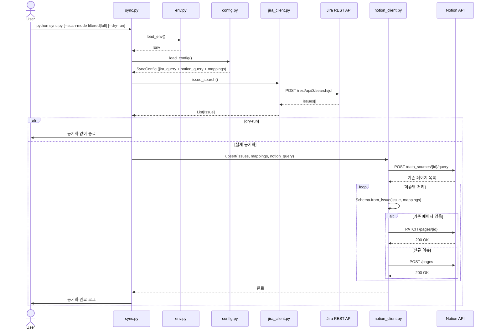

# jira-sync

Jira 이슈를 Notion 데이터베이스에 단방향(Jira → Notion) 동기화하는 Python CLI 도구.

Jira를 source of truth로 유지하면서 Notion에서 이슈 현황을 시각적으로 확인할 수 있습니다.

---

## 아키텍처

### 디렉토리 구조

```
jira-sync/
├── sync.py                 # CLI 진입점
├── sync_config.yaml        # JQL 쿼리, Notion 쿼리, 필드 매핑 설정
├── pyproject.toml          # 패키지 메타데이터 · 의존성 · entry point
├── requirements.txt        # 로컬 개발용 의존성 (pyproject.toml과 병존)
├── conftest.py             # pytest용 src/ 경로 등록
│
├── src/
│   ├── api_urls.py         # Jira · Notion REST API URL 상수
│   ├── config.py           # sync_config.yaml 로드 → SyncConfig
│   ├── env.py              # .env 로드 → Env
│   ├── jira_client.py      # Jira REST API 래퍼
│   ├── notion_client.py    # Notion API 래퍼 (NotionDatabase)
│   └── notion_schema.py    # Jira 필드 → Notion 프로퍼티 변환 (Schema)
│
├── tests/
│   ├── test_config.py
│   ├── test_jira_client.py
│   ├── test_notion_client.py
│   └── test_notion_schema.py
│
├── .env                    # 환경변수 (API 키 등)
└── .env.example            # 환경변수 템플릿
```

### 데이터 흐름

```
sync.py
  └─ load_env()                              # .env 로드
  └─ load_config()                           # sync_config.yaml 로드 · 유효성 검사
  └─ JiraClient.issue_search()               # JQL로 이슈 조회
  └─ NotionDatabase.upsert(issues, mappings) # Notion DB 조회 후 upsert
       └─ NotionDatabase.query()             # 기존 페이지 조회 (notion_query 적용)
       └─ Schema.from_issue(issue, mappings) # Jira 필드 → Notion properties 변환
       └─ PATCH /pages/{id}                  # 기존 페이지 업데이트
       └─ POST /pages                        # 신규 페이지 생성
```

### 시퀀스 다이어그램



### 동기화 전략

**Upsert by title** — `notion_type: title`로 지정된 매핑 항목을 기준으로 Notion DB에서 기존 페이지를 조회한 뒤, 있으면 update, 없으면 create합니다. 삭제는 수행하지 않습니다.

### 기본 동기화 필드 (sync_config.yaml)

| Jira 필드 | Notion 프로퍼티 | 타입 |
|---|---|---|
| `key` | `issue` | title |
| `fields.summary` | `제목` | rich_text |
| `fields.creator.displayName` | `담당자` | rich_text |
| `fields.priority.name` | `우선 순위` | select |
| `fields.status.name` | `상태` | status |
| `fields.created` | `생성일` | date |
| `fields.duedate` | `마감일` | date |

---

## 설치

### 로컬 개발

```bash
pip install -r requirements.txt
```

### pip 패키지로 설치 (GitHub)

```bash
# GitHub 레포에서 직접 설치 — sync 커맨드가 PATH에 등록됨
pip install git+https://github.com/<user>/jira-sync.git

# dev 의존성 포함 (pytest)
pip install -e ".[dev]"
```

설치 후 `python sync.py` 대신 `sync` 커맨드로 실행할 수 있습니다.

```bash
sync
sync --dry-run
sync --scan-mode full
```

## 환경변수 설정

`.env.example`을 복사해 `.env`를 작성합니다.

```bash
cp .env.example .env
```

```env
JIRA_URL=https://your-domain.atlassian.net
JIRA_EMAIL=your-email@example.com
JIRA_API_TOKEN=your-jira-api-token

NOTION_API_KEY=secret_your-notion-integration-key
NOTION_DATA_SOURCE_ID=your-notion-data-source-id
```

## 동기화 설정

`sync_config.example.yaml`을 복사해 `sync_config.yaml`을 작성합니다.

```bash
cp sync_config.example.yaml sync_config.yaml
```

이후 `jira_query.jql`, `notion_query`, `mappings`를 프로젝트에 맞게 수정합니다.

### sync_config.yaml 구조

```yaml
jira_query:
  jql: "..."          # Jira 이슈 필터 조건
  maxResults: 100
  fields:             # 조회할 Jira 필드 목록
    - summary

notion_query:
  filter:             # Notion DB 필터 (선택) — --scan-mode full 시 무시됨
    property: 상태
    status:
      does_not_equal: 완료
  sorts:              # 정렬 (선택)
    - property: 생성일
      direction: descending
  page_size: 100      # 최대 100 (선택)
  filter_properties:  # 응답에 포함할 컬럼 (선택, null이면 전체)
    - issue

mappings:
  - jira_field: key              # 점 표기법 지원: key, fields.summary, fields.status.name 등
    notion_property: issue       # Notion DB 컬럼명
    notion_type: title           # upsert 기준 키 (정확히 1개 필수)
  - jira_field: fields.summary
    notion_property: 제목
    notion_type: rich_text       # title | rich_text | select | status | date | url
```

**`notion_type` 지원 값**

| 값 | 설명 |
|---|---|
| `title` | upsert 기준 키. 정확히 1개 필수 |
| `rich_text` | 일반 텍스트 |
| `select` | 단일 선택 |
| `status` | 상태 |
| `date` | 날짜 (ISO 8601) |
| `url` | URL |

## 사용법

```bash
# 기본 실행 — --scan-mode 생략 시 filtered가 기본값으로 적용됨
python sync.py

# 다른 설정 파일 사용
python sync.py --config other_config.yaml

# 실제 반영 없이 결과만 확인 (--scan-mode 없이도 사용 가능)
python sync.py --dry-run

# 전체 스캔 — notion_query.filter를 무시하고 DB 전체 페이지 조회
# (완료 처리된 이슈 등 필터 밖 페이지도 중복 판별 대상에 포함)
python sync.py --scan-mode full

# 조합 예시 — 두 옵션은 독립적으로 조합 가능
python sync.py --scan-mode filtered --dry-run
python sync.py --scan-mode full --dry-run
```

### CLI 옵션

| 옵션 | 기본값 | 설명 |
|---|---|---|
| `--scan-mode filtered` | ✓ | `notion_query.filter`를 적용해 Notion 조회 범위를 좁힘 |
| `--scan-mode full` | | `notion_query.filter`를 제거하고 DB 전체 페이지를 스캔 |
| `--dry-run` | | Notion에 쓰지 않고 Jira 조회 결과만 출력. `--scan-mode`와 독립적으로 사용 가능 |
| `--config PATH` | `sync_config.yaml` | 사용할 설정 파일 지정 |

## 테스트

```bash
python -m pytest tests/ -v
```
